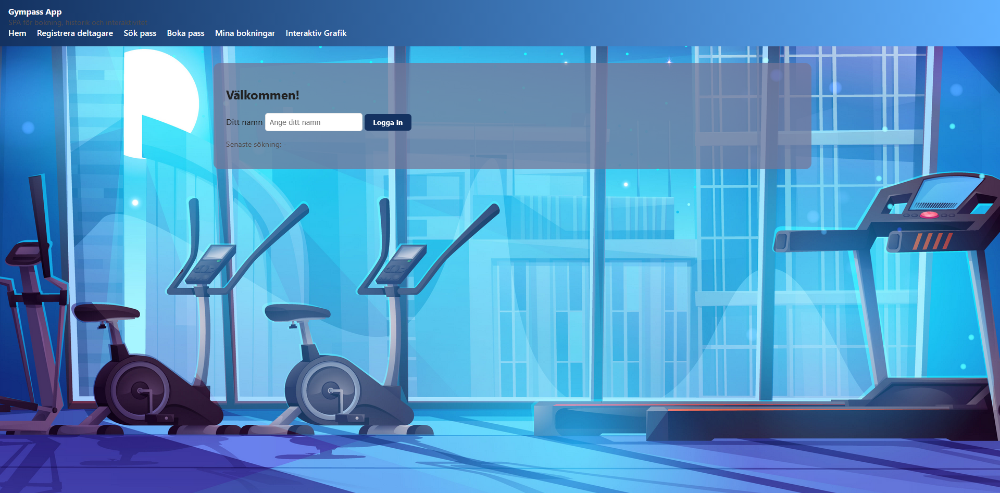
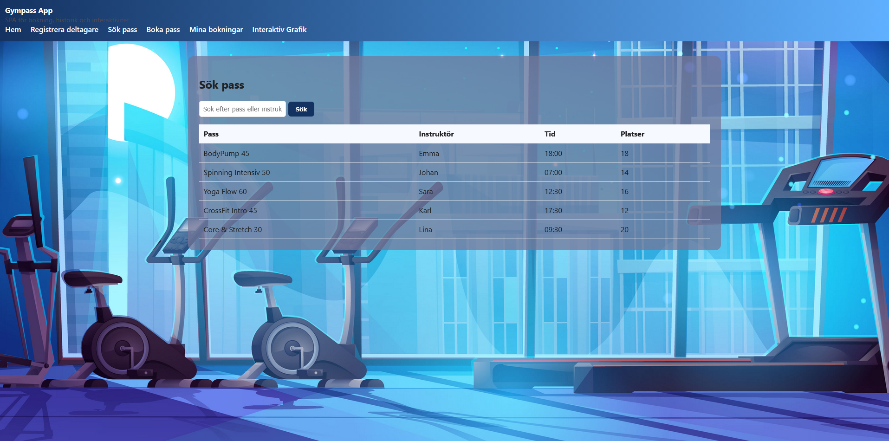
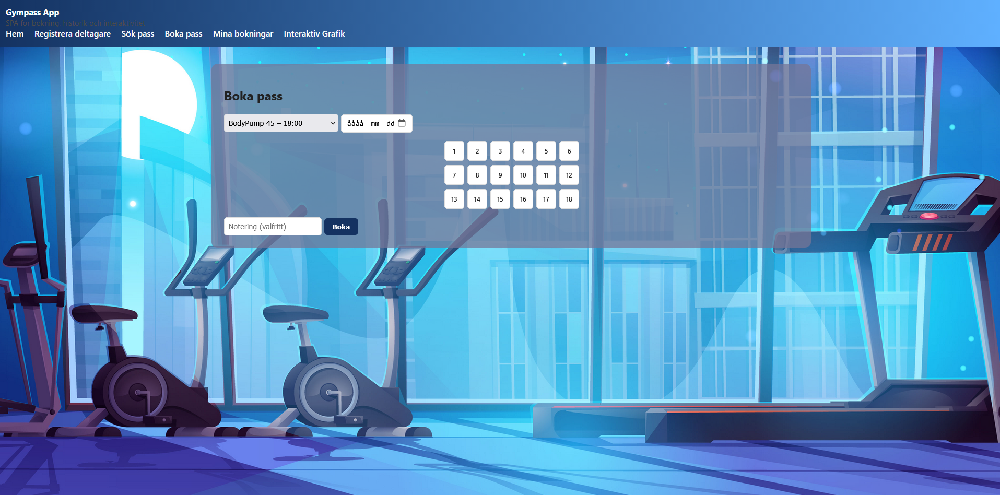
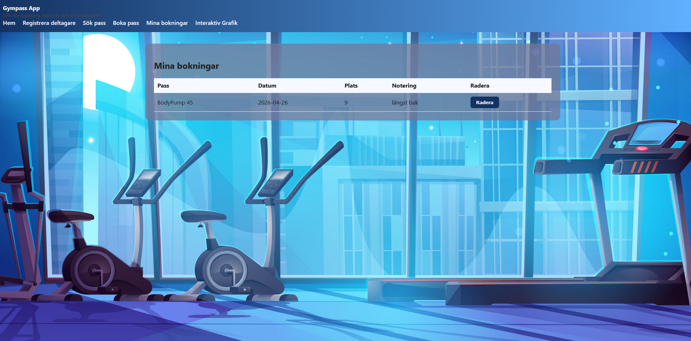

#  Gympass SPA Booking App

A Single Page Application (SPA) for booking gym classes, built with **HTML, CSS, JavaScript and React**.

The application allows users to search, book and manage gym sessions in a dynamic and interactive interface.

---

## 🚀 Features

* 🔐 **Login system** (client-side)
* 👤 **Participant registration** with custom validation
* 🔍 **Search & filter gym classes** in real time
* 📅 **Booking system** for reserving classes
* 🕘 **Booking history** rendered with React (JSX)
* 💾 **LocalStorage support** (data persistence)
* 🎨 **Interactive Canvas component** with animations and user interaction

---

## 🛠️ Technologies

* HTML5
* CSS3
* JavaScript (ES6+)
* React (with JSX via Babel)
* LocalStorage
* Fetch API
* HTML5 Canvas

---

## 📸 Screenshots

### Dashboard / Overview


### Search Gym Classes


### Booking System


### Booking History



---

## ⚙️ How to run

1. Clone the repository:

```bash
git clone https://github.com/a24wilka/gympass-spa.git
```

2. Open the project folder:

```bash
cd gympass-spa
```

3. Run the app:

* Open `index.html` in your browser
  or
* Run via local server (recommended)

---

## 📌 Notes

This project was developed as part of a web development course and demonstrates:

* SPA architecture
* API interaction
* Frontend state handling
* Client-side data persistence

---

## 👤 Author

**Willis Kabuye**
🔗 https://github.com/a24wilka

---
